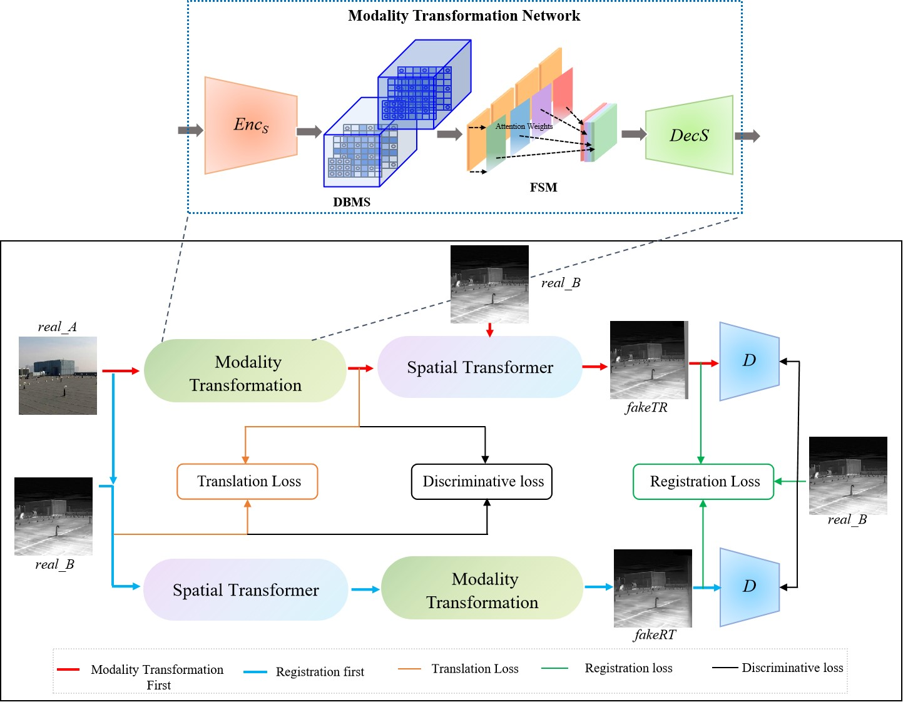

# CycleRegNet - Neural Multimodal Adversarial Registration

This is the official implementation of: 
CycleRegNet: A Scale-aware and Geometry-Consistent Cycle Adversarial Model for Infrared and Visible Image Registration.

Framework of network

## Getting started

This repository is based on the implementation of [NeMAR](https://github.com/moabarar/nemar). We
recommened getting yourself familiar with the former framework. Here we provide a basic guidline on how to use our code.

---

### (Step 1) Preparing your data

1. image_compose.py ：Merge images A and B into image AB, and save the data in the dataset. This needs to be done only once

---

### (Step 2) Train CycleRegNet model

2. train.py：Train the model using the dataset from dataset/train, and save the model in checkpoints

### (Step 3) Test CycleRegNet model
3. test.py：Process the test set using the trained model, and save the data in results.

### (Step 4) Train CycleRegNet model
4. evaluate.py："Calculate the metrics for the test set.

>The code and dataset will be available soon here.

### Citation

If you use this repository - please cite:

Since this repository is based on NeMAR & Pix2Pix & CycleGan framework - make sure you cite these two awesome papers:

    @InProceedings{Arar_2020_CVPR,
    author = {Arar, Moab and Ginger, Yiftach and Danon, Dov and Bermano, Amit H. and Cohen-Or, Daniel},
    title = {Unsupervised Multi-Modal Image Registration via Geometry Preserving Image-to-Image Translation},
    booktitle = {IEEE/CVF Conference on Computer Vision and Pattern Recognition (CVPR)},
    month = {June},
    year = {2020}
    }

    @inproceedings{CycleGAN2017,
     title={Unpaired Image-to-Image Translation using Cycle-Consistent Adversarial Networkss},
     author={Zhu, Jun-Yan and Park, Taesung and Isola, Phillip and Efros, Alexei A},
     booktitle={Computer Vision (ICCV), 2017 IEEE International Conference on},
     year={2017}
     }

    @inproceedings{isola2017image,
     title={Image-to-Image Translation with Conditional Adversarial Networks},
     author={Isola, Phillip and Zhu, Jun-Yan and Zhou, Tinghui and Efros, Alexei A},
     booktitle={Computer Vision and Pattern Recognition (CVPR), 2017 IEEE Conference on},
     year={2017}
    }
   
